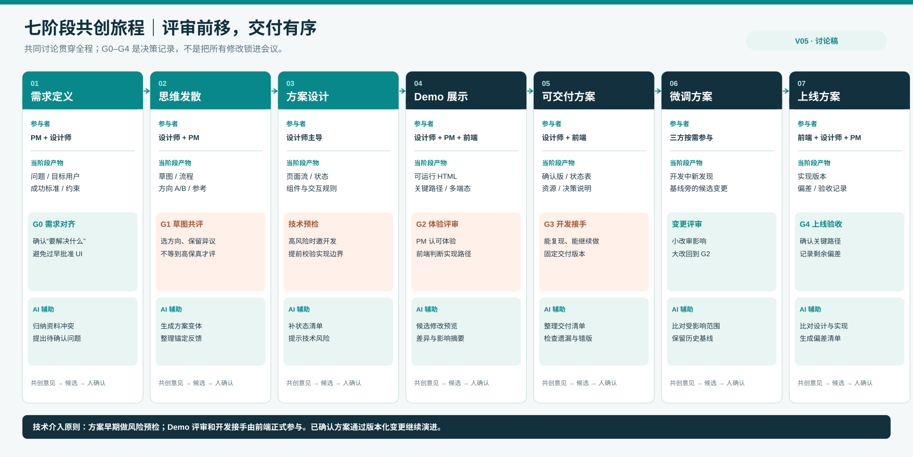
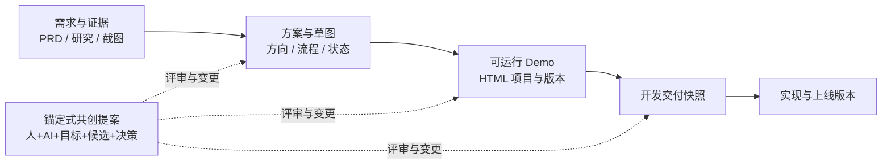
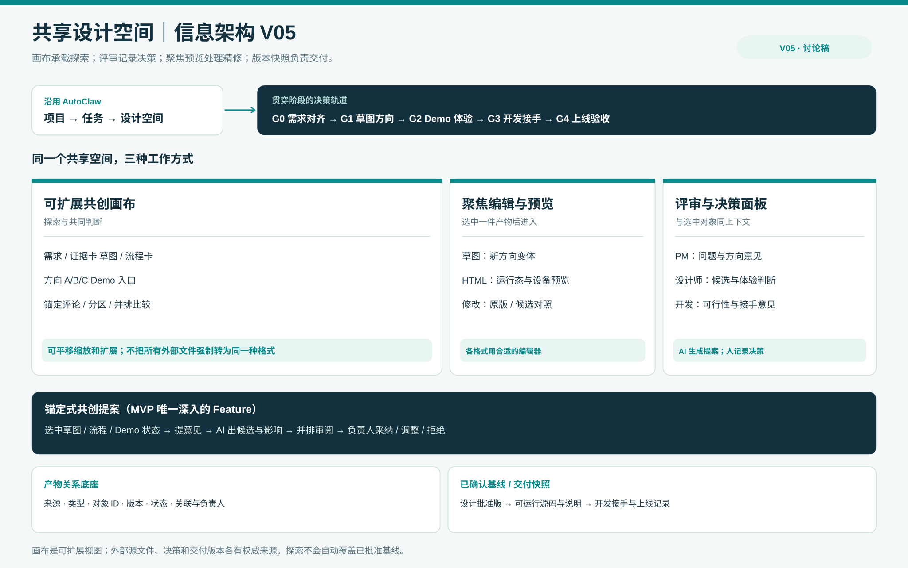

# AI Design Agent：从单人精修到多方共创｜方案修订 V05

> 2026-10-04 · 讨论稿。承接 [V04 用户旅程与信息架构](../journey_v04/2026-10-04_设计师用户旅程_痛点证据_信息架构草案_V04.md)。本版接受一个新的前提：**PM 评审与前端交付同等重要，但有先后次序；草图和 Demo 都可以被多方共同创作与评审。**

## 核心判断

你提出的方向**可实现**，但产品目标应写成：**让团队围绕同一份持续演化的方案共同作出决定，并让已确认的决定可靠地进入可运行 Demo 和开发交付物。**“取消反复改稿”不是把所有人放进同一张无限画布就能达成；真正要减少的是**失去上下文、重讲需求、误用旧稿和晚发现技术约束造成的返工**。讨论仍会发生，产品要让讨论直接落到对象、候选修改和可追踪的决策上。

这将 V03 的「修订提案」拓展为一个跨阶段但仍聚焦的核心 Feature：**锚定式共创提案**。PM、设计师或开发在某份草图、流程节点或 Demo 状态上提出问题；AI 可以形成候选方案、分析影响；负责人选择采纳、调整或拒绝；结论成为下一阶段的明确基线。MVP 先覆盖**方案草图和 HTML Demo**两种对象，不承诺对任意文件格式做原位无损编辑。

## 1. 重新安排七个阶段与评审时机

| 阶段 | 主要参与者与当阶段产物 | 最需要的共同评审 / 决策 | AI 适合承担 |
|---|---|---|---|
| ① 需求定义 | PM + 设计师；问题、目标用户、成功标准、限制条件 | **G0 需求对齐**：确认要解决的问题，而非立刻批准 UI | 汇总 PRD/研究材料，标出冲突、缺失假设与待确认问题 |
| ② 思维发散 | 设计师 + PM；流程草图、低保真方向 A/B、参考与反例 | **G1 草图共评**：在投入高保真 Demo 前选方向、保留异议 | 将意见锚定到对象，生成方向变体、整理相同/冲突反馈 |
| ③ 方案设计 | 设计师主导；选定方向的页面流、状态、组件/规则 | **技术预检**：前端对高风险约束早介入；PM 确认范围没有漂移 | 检查状态覆盖、设计系统约束与可访问性常见问题，输出待开发判断项 |
| ④ Demo 展示 | 设计师 + PM + 前端；可运行 HTML 与关键路径 | **G2 体验评审**：PM 确认目标与体验，前端确认实现路径和边界 | 从评审意见生成候选修改、差异与回归检查建议 |
| ⑤ 可交付方案 | 设计师 + 前端；已确认 Demo、状态表、资源、约束和代码说明 | **G3 开发接手**：前端确认能复现/能接手；PM 确认范围 | 把已批准决策编成交付清单，找遗漏与版本不一致 |
| ⑥ 微调方案 | 设计师 + PM + 前端；开发中的新发现、变更候选 | **变更评审**：小改明确影响，重大改动返回 G2 | 在既有基线旁生成候选，汇总影响到哪些页面/状态/文件 |
| ⑦ 上线方案 | 前端主导，设计师 + PM 验收；上线版本与偏差记录 | **G4 上线验收**：对照已批准方案与真实实现 | 辅助比较上线页面与确认版、记录偏差；不代替人工质量判断 |

**草图阶段就应开始共同评审**。这时 PM 更容易纠正问题和方向，而不需要等设计师把所有细节做完。Demo 阶段仍需第二次评审，因为流程、异常态和响应式表现只有运行后才容易看清。两次评审回答的问题不同：**G1 选对方向，G2 验证体验与实现边界**。

开发者不必参加每次发散会议，但不应首次出现在交付当天。我的推荐是：**在 G1 后、做高保真 Demo 前进行一次轻量技术预检；G2 Demo 评审与 G3 接手再正式参与**。遇到既有代码库、真实数据/API、权限规则、复杂状态、跨端一致性、性能或无障碍风险时，预检应提前到 G1。这和 Figma 针对 200 位前端工程师的调查方向一致：55% 希望更早介入设计过程，但该数据不能直接证明每个项目都需要开发全过程参会。[S1]

## 2. 传统交付物在 AI 介入后怎样变化

| 传统阶段产物 | 共创空间里的表达 | 能否直接成为开发基线 |
|---|---|---|
| 需求文档 / 研究摘要 | 带来源和待确认项的需求卡、证据卡 | **否**；它定义问题，不是实现规格 |
| 草图 / 用户流程 / 方向板 | 画布上并列的方向、可点击低保真流程、针对对象的意见 | **否**；先形成方向决策 |
| 高保真 Demo | 可运行 HTML、关键状态和设备预览、候选版本 | **有条件**；要核查依赖、状态覆盖、语义与实现质量 |
| 已批准设计方案 | 方向决策、页面/状态清单、约束、确认版本 | **设计基线**；还不是自动可合并生产代码 |
| 开发接手包 | 固定版本的源码/资源/说明、已知问题与决策记录 | **可接手**；是否可直接入库由前端判断 |
| 开发调整 / 上线验收 | 基于已确认版本的新提案、实现差异和关闭记录 | **版本化变更**；不能悄悄改写已批准基线 |

技术难点不是把 Demo 导出成 ZIP，而是 **Demo 代码与生产项目是否同源**：组件体系、路由、状态管理、真实数据、接口、权限、测试和无障碍要求可能不同。HTML Demo 可以作为可运行规格和工程起点，不能默认“设计完成即上线代码”。Figma 的“本地代码库里视觉编辑、分支与 PR”说明这条路径已有技术样本，但其接入真实代码库的能力截至本次核对仍为**有限封闭测试**，不能当作 AutoClaw 现成功能。[S2]

## 3. 云端共同创作与“无限扩展”是否可行

**可行，但无限画布只是团队看到的表面。**Miro 已公开展示在共享画布中从便签、PRD 或截图产生多屏原型，让 PM、设计师和开发早期讨论；Figma 已有分支评审、并排比较和受控合并。这证明“同一空间里讨论、修改、评审”不是纯概念。[S3][S4]

要避免“所有产物都能放上画布，却不知道哪份有效”，底层应是**有类型、有来源、有关系的产物网络**，画布只是其中一种视图：

每件产物至少要记录：`artifact_id、类型、所属任务、权威来源/链接、引用版本、负责人、状态、关联对象`。每项评审记录：`target_id、target_version、意见/依据、AI 候选、影响范围、决策人、结论、时间`。这样 AI 才能对“这一页的错误态”“这个方向的争议”“已批准的 v2”精准工作；仅把文件堆进一个无限画布，不会自动形成管理能力。

建议的产品结构是：**项目/任务 → 共享设计空间**。空间中可以无限平移缩放、分区、并列草图、参考、Demo 与评论；选中一件产物时进入**聚焦编辑/预览**；顶部有贯穿阶段的**评审与决策轨道**；右侧是**来源、参与者、提案、版本**。已批准方案与交付包放在固定基线中，画布上的探索不会自动覆盖它们。

## 4. MVP 与远期能力的边界

| 能力 | MVP 建议 | 以后再做 / 必须验证 |
|---|---|---|
| 共享空间 | 在现有任务内增加可缩放、分组的方案空间；可放链接卡、草图、流程、Demo 缩略/运行入口 | 大型白板、任意格式原位编辑、跨项目知识库 |
| 在线协作 | 同一对象的锚定评论、参与者状态、评审结论；可异步参与 | 多人同时编辑同一 HTML 源文件的实时冲突解决 |
| AI 共创 | 选对象提出意见 → AI 生成**候选** → 前后比较 → 人确认 | AI 自动修改已批准基线，或自动接受有争议的方案 |
| 评审节奏 | G0 需求对齐、G1 草图方向、G2 Demo 体验、G3 开发接手四类轻量状态 | 复杂组织级审批流和权限规则 |
| 交付 | 固定已批准的 HTML 版本、状态清单、资源与决策说明 | Figma/代码/外部系统之间的无损双向实时同步、自动生产合并 |

**Task 2 值得只选一个深入的 Feature**：锚定式共创提案。它把线上评论从“留一句话”等待他人返工，变成“对一个明确目标共同形成候选、比较并决策”。V03 的局部修订机制是这个 Feature 在 HTML Demo 阶段的一个实例；草图阶段则生成新的方向变体，而非强行回写像素图。

## 5. 下一轮最值得验证的设计问题

1. **G1 草图评审要轻到什么程度？** 比较 A/B 方向、标注关键风险和选择方向，应能在同一会话完成；不能变成审批表。
2. **谁拥有确认权？** 推荐 PM 对问题与方向负责，设计师对体验细节负责，开发对可实施性与接手负责；跨职能争议需要明确决策人，AI 只整理/建议。
3. **何时触发开发提前介入？** 用约束清单给出提醒，由设计师/PM 邀请开发；不强制开发参与每一轮草图。
4. **上线后如何继续迭代？** 基线不可被静默覆盖，新发现建立提案与新版本，仍可沿原任务追溯“为什么这样做”。

下一版界面最值得先画 **G1 草图共同评审** 与 **G2 Demo 上锚定修改** 两个高价值画面，然后串联“决策记录 → G3 开发交付”。本稿仍需真实 AutoClaw HTML 任务走查和目标用户访谈验证，不把外部工具的能力当作 AutoClaw 现状。

## 来源

- [S1] [Figma：What do developers want from designers?](https://www.figma.com/reports/designer-developer-collaboration/)，200 位前端工程师调查；55% 希望更早进入设计过程。
- [S2] [Figma：Make in your local codebase](https://help.figma.com/hc/en-us/articles/40775535020695-Make-in-your-local-codebase)，官方帮助文档注明封闭测试；[产品说明](https://www.figma.com/blog/figma-make-now-on-your-local-code/)介绍分支、提交、PR 与设计/代码往返。
- [S3] [Miro：Introducing Miro Prototyping](https://miro.com/blog/introducing-miro-prototyping/)，官方介绍画布上的早期多屏原型与共同评审，页面标注 beta。
- [S4] [Figma：Guide to branching](https://help.figma.com/hc/en-us/articles/360063144053-Guide-to-branching)，官方说明分支评审、并排差异和受控合并；并非所有套餐均可用。
- [S5] [Miro：Introducing the Intelligent Canvas](https://miro.com/blog/introducing-intelligent-canvas/)，官方说明画布、智能对象和跨流程 AI；属于产品能力描述。
