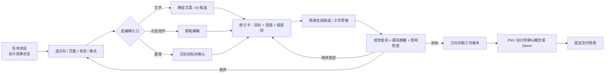

# Design 工作区｜界面定域修订功能定义 V07

> 2026-10-04 · 功能讨论稿。承接 [V06 草图三态](../sketch_v06/2026-10-04_草图三态与可累积精准微调_方案修订_V06.md)，把主案例从图片素材改为 **AutoClaw 生成的网页 / UI**。文中界面和技术方案为建议，尚未用真实 AutoClaw HTML Design 任务验证；不能据此断言现有产品缺少这些能力。

## 决策先行

**唯一深入的 Feature：界面定域修订。**设计师在某个**方向 × 页面 × 状态 × 设备断点**的可运行预览中，选中文字、点击元素或画笔圈出视觉区域，提出一次有明确边界的修改。Agent 在隔离候选中完成修改；工作区显示视觉差异、受影响范围与可运行结果。设计师决定采纳、继续调整或放弃。采纳结果接续当前方向，PM 在概念 / Demo 节点确认方案，开发接收固定版本。

这里的“定域”指**先定义修改对象与生效范围**，不是承诺 AI 永远只改用户画出的像素。精准程度取决于源文件结构、元素映射、共享样式和交互状态；不确定时必须扩大影响提示或要求用户选定目标。

**不把无限画布、画笔或文字改写单独包装成创新点。**Auto Design 官方已描述评论改局部、画布微调、多端预览与 ZIP 导出；Canva 白板支持无限空间、实时协作与点子整理；Codex 和 GitHub 展示了“候选改动 → 差异评审 → 再修改 / 接受”的成熟范式。[S1][S2][S3][S4] 本题的机会是将这些动作适配设计师：**视觉定位与代码修改同源、明确页面/状态/断点影响、保留方向演化与评审决定、固定交付版**。

## 1. 三种编辑入口，不是三套独立流程

| 入口 | 最适用的场景 | 用户动作 | 系统最小反馈 | 不适用时的转向 |
|---|---|---|---|---|
| **文字微调** | 标题、标签、按钮文案、错误提示、说明文字 | 直接点文字；输入确定文案，或用 AI 选语气/长度生成候选 | 当前文案、所在状态、是否为共享文案、修改后的溢出风险 | 文案受接口或本地化系统控制时，仅生成建议，不伪装为已改源文件 |
| **智能编辑** | 对一个明确组件调整层级、布局、尺寸、样式或交互规则 | 点选 UI 元素/容器，描述“改什么”和“保留什么” | 命中的组件、默认生效范围、可能影响的其他实例 | 若是整体信息架构或多页流程变化，转“新方向 / 大范围提案” |
| **画笔圈选** | 元素难以直接点中、想表达一片视觉关系、图片资产内部局部编辑 | 在当前预览上涂抹/框选；给一句意图 | 圈中哪些可识别元素、截图坐标与源对象的映射置信、编辑范围 | 不能唯一映射源对象时让用户选候选元素；仍无法定位则退为页面级建议，不显示“精准修改” |

三种入口统一进入一张**修订卡**：`目标 → 意图 / 保留项 → 候选 → 对比 → 决定`。文字确定性修改可以快速应用到**工作草稿**并撤销，无需每次召开评审；AI 生成、结构变化或跨状态影响则先显示候选。工作草稿与“PM 确认概念”“Demo 通过”“准备交付”是不同状态，不能混为一个“已完成”。

### 什么时候用画笔，什么时候用元素点选？

优先**点选真实 UI 元素**，因为它能保留组件、样式、状态和代码的关系。画笔是更自然的“指给 AI 看”的补充：例如“这片提示与按钮之间太挤”，而不是把截图涂过的像素当成源代码对象。画笔选区应保存**截图版本、设备尺寸、滚动位置与相对坐标**；预览缩放或切设备后重新投影。用户发起修改前，界面高亮系统实际识别到的 DOM 元素或资源图层。

## 2. 四类典型任务与对应路径

### 场景 A：文字微调——确定内容，尽量直接

**触发**：PM 说“这个错误提示太抽象”。设计师打开`方向 B / 邀请成员 / 邮箱错误态 / Mobile / v3`，点击文案“输入有误”。

1. 工作区显示文本内联编辑；设计师输入“请输入有效的邮箱地址”。如果需要 AI，点“给 3 个更简洁的说法”，而不是重生整页。
2. 系统提示这是“仅此错误态”还是“该组件所有状态”的共享文案；默认只改当前状态。若文本来自外部数据或国际化键，提示它的权威来源。
3. 预览立即展示文案长度、换行与按钮位置；工作草稿记录变更。设计师可撤销或把它并入下一次评审快照。

**为什么适合**：输入确定、源文字可定位，AI 主要帮助措辞与检查；不必走一次昂贵的全项目生成。

### 场景 B：智能编辑——明确组件，限制范围

**触发**：设计师认为移动端邮箱错误提示距离输入框过远。她点选错误提示组件，输入“移到邮箱输入框正下方，保持桌面端及成功态不变”。

1. 修订卡自动填入目标：`方向 B / 邀请成员 / 邮箱错误态 / Mobile / 错误提示组件 / v3`；保留项显示 Desktop、成功态和品牌变量。
2. Agent 先判断目标是否由共享样式控制。若修改可能影响其他视图，卡片提前显示“可能影响 3 个页面的同类提示”；用户可改成组件局部样式或允许更广范围。
3. 在隔离候选 v3-c1 修改源文件，运行预览；展示 Mobile 原版与候选，以及 Desktop / 成功态的回归入口。
4. 设计师比较、检查并采纳为工作草稿 v4；若出现越界改动，则继续限定候选或放弃，v3 不动。

**为什么适合**：目标是可定位的组件，问题不仅在视觉，还在共享样式的连带影响。

### 场景 C：画笔圈选——表达视觉问题，但先确认命中对象

**触发**：PM 在预览里画圈，标注“这一块信息太密，希望主操作更突出”。圈内包含标题、说明文字、按钮和一个插图。

1. 系统把画笔覆盖的区域转为**视觉锚点**，高亮识别到的四个对象；PM 的圈选仍是一条评审意见，**不会自动改稿**。
2. 设计师把意见拆成可执行意图：“缩短说明为一行、增加主按钮对比；保持页面结构和插图不变”。系统展示目标对象及保留项。
3. Agent 生成候选；审阅时并排显示圈选区域的视觉差异，同时列出源文件改动与圈外变化。设计师采纳后，PM 可在同一对象上看到“原问题—修改—结果”。

**为什么适合**：提意见的人能自然指出“这里”，但真正执行需要设计师把模糊意见转成多个明确变化。AI 协助拆解，不替代责任人判断。

### 场景 D：不应强行使用定域修订

“把整个邀请流程改成先选角色再填邮箱”影响页面顺序、状态与数据依赖。这应创建**方向分支 / 大范围方案提案**，由 PM 和设计师先比较概念，必要时让开发做技术预检；不能靠一个圈选承诺局部改动。纯图片里的袖口换色属于**资产编辑**，可用画笔，但交付仍要检查该资产在 HTML 中的引用和版本。

## 3. 一条完整的核心链路

**链路中的两个决定必须分开**：`采纳一次修改`只表示设计师认为这次改动可以进入当前工作版本；`确认概念 / Demo`才表示团队认可这一阶段方案。前者高频、轻量，后者在用户定义的第三个草图状态结束及 Demo 体验评审时发生。

### 关键界面状态

1. **成果总览**：方向 A/B/C、页面/状态数、当前工作版、待处理意见与最近修改；从 AutoClaw 现有任务与“输出产物”入口进入。
2. **聚焦预览**：中间是可运行页面，顶部固定显示方向、页面、状态、设备与版本；画布上的轻工具条只有“选元素 / 改文字 / 画笔 / 评论”。
3. **修订卡**：右侧显示“你要改谁”“仅此状态还是所有实例”“保留什么”“为什么改”；命中不确定时先让用户确认，不进入生成。
4. **候选审阅**：原版和候选同步切页/状态/设备；视觉差异、源文件变化、可能受影响的共享组件列在同一视图；明确“候选尚未采纳”。
5. **决策与交付**：方向版本历史、PM / 设计师阶段确认、未解决意见；导出页只引用固定确认版，并含运行说明和页面/状态清单。

### 修订卡最小字段

`proposal_id · direction_id · base_version · page_id · state_id · viewport · target_ref · input_mode · intent · preserve_constraints · proposed_scope · changed_files · affected_views · candidate_version · author · status · decision_reason`。

`target_ref` 优先是稳定组件 / DOM 标识；画笔额外存截图锚点。若基线版本更新导致目标已不存在，修订卡标记“需重新定位”，不得静默应用到相似元素。`status` 至少区分：草稿、生成中、待审阅、已采纳、已放弃、生成失败。

## 4. MVP 取舍与技术边界

| 优先级 | 范围 | 取舍理由 |
|---|---|---|
| **P0** | AutoClaw 自己生成且源文件可用的 HTML；页面/状态/断点定位；文字确定性编辑；点选元素的智能修改；候选双预览；采纳/放弃；固定版本导出 | 能完整跑通一次 UI 初稿到开发接手，不依赖外部格式无损转换 |
| **P0 的受限画笔** | 画笔圈选作为视觉锚点；生成前必须显示实际识别到的元素；映射不稳时明确降级 | 满足自然指认，不承诺像素圈选一定对应唯一代码节点 |
| **P1** | PM 在对象上异步评论并关联修订卡；1–3 方向并排；跨页面回归清单；人工可编辑的约束模板 | 对共创价值很大，但可以先用少量人工状态与链接验证 |
| **后续** | 任意外部网页原位修改、Figma↔HTML 无损双向同步、多人实时改同一源文件、任意图片/视频的统一精准编辑、自动合并生产仓库 | 权威来源和同步冲突复杂，超出本次 HTML 主链路 |

**失败与降级规则**：预览/构建失败时保留基线；全局 CSS 或共享组件改动必须显示更广影响；仅完成截图差异不等于验证交互；无法定位 DOM 时允许页面级提案，但按钮不能仍写“仅修改这一处”。ZIP 可供开发接手，不自动等同可直接上线的生产代码。

## 5. 原型与验证应聚焦什么

只画一条可点击主路径：**打开“邀请成员”设计成果 → 切到 Mobile 错误态 → 改错误文案 → 圈选提示/按钮区域并提出修改 → 看实际命中对象 → 审阅候选与 Desktop 对比 → 采纳 → PM 确认 Demo → 固定版本交付**。再补两个异常分支：画笔命中多个对象、共享样式影响其他状态。

研究不应只问“喜不喜欢 AI 编辑”，而应观察：设计师能否在不重述整页需求的情况下完成两次连续修改；能否指出候选改了哪里、是否越界；PM 能否区分“设计师采纳改动”和“方案已确认”；前端能否打开交付包复现被评审过的同一状态。建议先做 5–8 位设计师、2–3 位前端的发现性测试；数字是研究计划，不是已经获得的数据。

## 借鉴与来源

- [S1] [Auto Design 官方介绍](https://autoclaw.zhipuai.cn/blog/product/auto-design-ai-designer/)：公开描述聊天改大方向、评论改局部、画布微调、多端预览和 ZIP / HTML 导出；公开说明不代表本稿已实测每个入口。
- [S2] [Canva AI Whiteboards](https://www.canva.com/newsroom/news/canva-ai-whiteboards/)：无限画布适合发散、排序、实时协作；[Magic Edit](https://www.canva.com/features/ai-replace/)说明画笔选区更适合图片局部替换。
- [S3] [Codex app](https://openai.com/index/introducing-the-codex-app/)：隔离工作区、线程内查看变更及对 diff 评论；这是代码协作范式，不是现成设计 UI。
- [S4] [GitHub Copilot agents](https://docs.github.com/en/copilot/how-tos/copilot-on-github/use-copilot-agents/overview)：Agent 提交候选 PR，人查看、要求继续修改、批准或合并；不能直接照搬 PR 到草图阶段。
