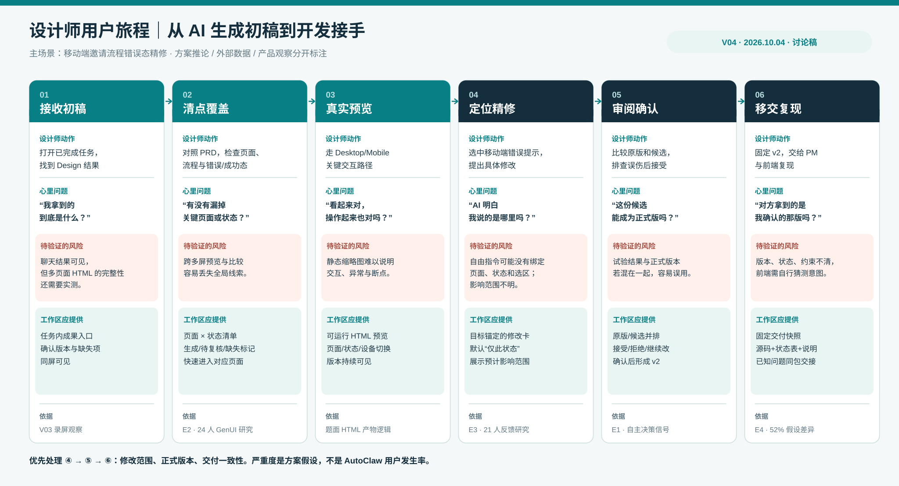
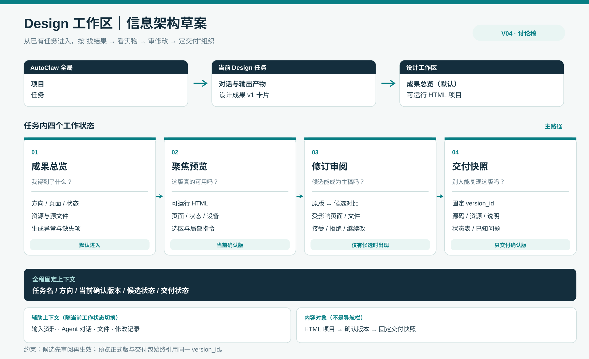

# 设计师从 AI 初稿到开发接手｜用户旅程与信息架构草案 V04

> 2026-10-04 · 讨论稿。承接 [V03 MVP 初稿](../mvp_v03/2026-10-04_AutoClaw_Design工作区_MVP初稿_V03.md)。默认主场景是：**产品设计师收到 AutoClaw 生成的可运行 HTML 初稿，完成精修并交给前端**。这是目前根据测试题所作的工作假设，尚待与你确认。

## 先界定这次要解决的问题

设计师需要的不是更快地得到一张好看的首页，而是能回答：**这份初稿覆盖了什么、哪里要改、改动是否可控、交出去的是哪一版、接手的人能否复现。**本轮把它拆为三个候选核心痛点：

1. **看不全**：页面、流程、状态、断点散在对话或多张预览里；设计师难以判断“是否覆盖需求”。
2. **改不准**：AI 可以继续生成，但指令没有稳固绑定页面／状态／区域，候选修改可能波及别处；“正在试”和“已确认”混在一起。
3. **交不清**：开发者拿到 HTML、截图或文件包后，难以辨认最终版本、交互触发方式、设计意图和未完成项。

这三项是**设计假设**，并非已经测得的 AutoClaw 用户痛点。对这道测试题，我建议优先解决 1→2→3 的完整闭环，其中最需要做出差异化交互的是第 2 项；第 3 项决定这个闭环是否真的“可交付”。

## 1. 数据能证明什么，不能证明什么

| 外部证据 | 可合理推导的设计要求 | 不能外推为 |
|---|---|---|
| Figma 2026 对 **906 位数字产品设计师**的调查：89% 认为 AI 让工作更快、91% 认为改善设计；87% 认为创作自主权帮助其发挥，91% 认为明确目标和预期有帮助。[E1] | “再提速生成”未必是本题最大机会；保留设计师判断权，并让修改目标/完成标准清楚。 | 不能说 89% 的 AutoClaw 用户已对生成满意，也不能据此证明“修订提案”需求比例。 |
| 一项 **24 位 UX 设计师和 PM、同一公司**的 GenUI 对照研究发现，探索多个方向时，跨多屏预览本身是困难点；高保真结果更符合参与者的工作习惯。[E2] | 成果总览要帮助扫清页面/方向，聚焦预览要保持高保真、可运行；两种尺度需要衔接。 | 这项研究聚焦早期探索，不能直接证明 AutoClaw 后期交付问题或无限画布优于列表。 |
| CHI 2026 论文让 **21 位设计师**为生成 UI 提供约 1,460 份标注。研究者在“直接修订”产生的比较样本中，与设计师的选择一致率为 **76.1%**，单纯二选一排序样本为 **49.2%**；作者提醒其任务使用合成 UI、时长约一小时。[E3] | 设计反馈不该只有“喜欢/不喜欢”；带位置的评论、标注和直接修订更能承载具体判断。 | 这不是产品转化率或“修订提案会提升 26.9 个百分点”的证据；两种样本的生成机制也不同。 |
| Figma 2025 设计师/开发者报告：**84% 的设计师至少每周与开发者协作**；开发者最常提到的协作挑战是双方**假设不同（52%）**。[E4] | 交付物要附版本、状态、约束与设计决策，帮助接手方减少猜测；开发者应能从同一对象进入。 | 不能说 52% 的 AutoClaw 交付失败，也不能推断所有误解都能靠多一份文档解决。 |
| Figma 2026 AI 报告称 **76% 的受访产品构建者至少一半工作发生在画布上**，41% 认为 AI 已显著改变协作方式（两年前为 7%）。该报告的 8,403 份问卷与 639 次访谈是**三年累计**样本。[E5] | 需要一个可并排看结果和协作判断的空间，不能把所有工作压进线性聊天。 | 不能由“画布常用”直接得出 MVP 必须做无限画布，更不能把该比例当作 AutoClaw 用户占比。 |

**证据结论**：外部数据支持“可看清、可表达判断、可传达意图”三个方向；**AutoClaw 内部的频率、严重度与具体入口仍缺乏一手数据**。V03 录屏只覆盖通用任务/图片结果，未覆盖 HTML Design 任务，因此本稿对现状缺口保持假设口径。

## 2. 一条完整的设计师用户旅程

场景：设计师为“成员邀请”流程输入 PRD、旧版截图和品牌参考，Agent 生成 HTML。她要修正**移动端无效邮箱提示的位置**，确认桌面端和成功态未受影响，并将可运行版本交给前端。

| 阶段 | 设计师要完成的工作 / 心里问题 | 现有材料支持的风险判断 | 我们要交付给她的能力 |
|---|---|---|---|
| ① 接收初稿 | 打开任务，知道生成是否完成、有哪些结果。“我拿到的是什么？” | AutoClaw 录屏里单张图片可在聊天消费；多页面 HTML 能否同样快速盘点需实测。[V03] | 任务内的设计成果入口、当前确认版本与缺失项。 |
| ② 清点覆盖 | 对照 PRD 找页面、流程、错误/成功状态。“缺的是哪一步？” | [E2] 提醒多屏想法难以预览；这是跨产品的研究信号。 | 页面 × 状态索引；每项标记已生成、需复核、缺失。 |
| ③ 真实预览 | 走 Desktop/Mobile 关键路径。“看起来对，操作也对吗？” | HTML 的交互与断点无法仅由单张截图判断；此处是任务逻辑推论。 | 可运行预览，页面/状态/设备与版本持续可见。 |
| ④ 定位精修 | 选中无效邮箱提示，说明移动端应放在字段下。“AI 明白具体改哪里吗？” | Lovart 录屏表明选对象后给局部指令的模式可行；[E3] 支持位置化反馈的价值，HTML 回写仍待验证。 | 目标锚定的指令：页面、状态、断点、区域默认带入；展示修改范围。 |
| ⑤ 审阅确认 | 比较旧版与候选，排查桌面/成功态误伤。“这版能成为主稿吗？” | [E1] 提示设计师仍需要自主决策；V03 方案的候选版本机制是待验证产品假设。 | 候选与正式版隔离；前后比较、受影响项、接受/拒绝/继续改。 |
| ⑥ 移交复现 | 固定 v2 给 PM/前端。“对方拿到的是我刚确认的吗？” | [E4] 表明协作频繁且假设差异常见。 | 固定交付快照：同一版本的可运行源码、状态表、素材、已知问题和变化说明。 |

**最可能的高风险区间是 ④→⑤→⑥**：局部修改虽小，却同时考验 AI 是否改对、是否影响其他状态、交付版本是否一致。这个判断是基于场景和外部研究的**优先级假设**；不画未经访谈支持的“情绪曲线”或痛点发生率。

## 3. 对痛点的初步排序与取舍

| 假设 | 对结果的损害 | MVP 判断 | 需要哪种一手证据推翻或证实 |
|---|---|---|---|
| H1 结果覆盖不透明 | 漏状态时后续修改和交付都建立在错误基线上 | **P0**：成果总览/覆盖清单 | 给设计师一份真实 HTML 任务；看其能否在 1 分钟内指出缺失页与状态。 |
| H2 修改目标和生效状态不透明 | 用户不敢接受候选，或误把候选当成已确认版本 | **P0，交互重点**：修订提案 | 观察 5–8 位设计师能否正确说出“这次改哪里、影响哪里、哪个是正式版”。 |
| H3 开发接手缺上下文 | 需要多次追问，版本错用或状态难复现 | **P0**：交付快照 | 让 2–3 位前端不经口头说明复现错误态，并记录澄清问题。 |
| H4 缺少无限画布 | 多方向探索和素材并排效率受限 | **P1**：先提供小范围并排比较，不做自由画布 | 若真实任务频繁需跨方向自由编排，且列表/并排不足，再上调优先级。 |
| H5 缺少 Figma 双向同步 | 设计师需要在惯用工具精修 | **待验证**：不承诺无损转换 | 查真实素材：HTML 是否只是 demo，最终开发是否必须依 Figma 节点/组件。 |

这份排序刻意把“增加更多生成方式”放在后面：题目要求的是**初稿之后**的查看、修改、管理和交付；V03 已确认 Auto Design 官方描述过聊天、评论、画布编辑和多格式导出，首先要核对这些能力之间的衔接，而不是再发明一个同名按钮。[E6]

## 4. 由旅程推导的初版信息架构

**第一层：沿用 AutoClaw 任务归属**。项目 → 任务 →「对话 / 设计工作区」，任务完成后从现有“输出产物”进入设计成果。不新建全局 Design 首页；这是 MVP 的架构取舍，不是对现有页面数量的描述。

**第二层：工作区围绕四个用户判断组织**，而非按工具名堆导航：

1. **成果总览**：本次任务的方向、页面/状态覆盖、资源和缺失项；默认进入。
2. **聚焦预览**：一个确认版本的可运行页面；页面/状态/断点作为全局上下文；选中区域后露出修改入口。
3. **修订审阅**：只在有候选时出现；原版/候选对比、受影响范围、接受/拒绝。
4. **交付快照**：只接收已确认版本；运行文件、资源、README、页面状态表与已知问题。

**横贯四层的固定信息**：任务名／方向／当前确认版本／候选状态／交付状态。右侧面板承载上下文：输入资料、Agent 对话、文件与修改记录，随当前视图切换；这些是辅助信息，不与“成果总览”平级抢导航。

**核心对象层级**：`任务 → 设计成果（可运行 HTML 项目）→ 方向/方案 → 页面 → 状态 → 断点/设备`；修订提案附着在某一目标和基线版本上，接受后产生新确认版本；交付快照引用固定版本。若真实产品仅有一个方向，方向层自动隐藏，不强加空层级。

**关键原则**：`preview.version_id = delivery.version_id`。用户正在看的正式版与导出的开发包必须同源；候选可以预览，但默认不能当正式包交付。

## 5. 与你讨论后要定下来的三个决策

| 决策 | 当前建议 | 如果你的目标不同，架构会怎样变 |
|---|---|---|
| **主要交付对象** | 设计师 → 前端，产物是可运行 HTML 项目与交付说明 | 如果主要给 PM 评审，“评审状态/评论/分享”应提前，源码包退居次要。 |
| **主要精修方式** | 预览中选中目标 → AI 出候选 → 设计师决定是否接受 | 如果设计师习惯在 Figma 完成最终稿，则应评估 Figma 作为主载体，但需证明 HTML→Figma 可保持交互和组件语义。 |
| **MVP 覆盖范围** | 一次任务内一个 HTML 项目，多个页面/状态；方向层可选 | 如果同一任务需要大量跨方向探索，成果总览可能升级为画布式空间。 |

**下一轮验证**：拿到真实 Auto Design 的 HTML 任务（无须创建新任务也可使用现成结果），走查“任务完成→产物→预览→一次修改→导出”，逐条标注已有、缺失和难发现的能力。再做 5–8 位设计师任务观察、2–3 位前端接手测试。这些样本量是轻量发现性研究计划，不是统计显著性承诺。

## 来源与口径

- [E1] [Figma, State of the Designer 2026](https://www.figma.com/blog/state-of-the-designer-2026/)，906 位数字设计师的在线调查；样本并非 AutoClaw 用户，2026-10-04 核对。
- [E2] [Chen 等，Rethinking the UI of GenUI](https://arxiv.org/html/2606.13843v2)，2026，24 位来自同一公司的 UX 设计师/PM，对照的是 0→1 探索工具。
- [E3] [Wu 等，Improving User Interface Generation Models from Designer Feedback](https://arxiv.org/html/2509.16779v2)，CHI 2026，21 位设计师；合成 UI 和短时任务限制外推。
- [E4] [Figma, 2025 Designer and Developer Trends](https://www.figma.com/reports/designer-developer-trends/)，设计师/开发者协作调查；网页未展示完整抽样细节。
- [E5] [Figma, 2026 AI Report](https://www.figma.com/blog/2026-ai-report/)，三年累计样本；Figma 用户与市场抽样存在平台视角。
- [E6] [AutoClaw, Auto Design 官方介绍](https://autoclaw.zhipuai.cn/blog/product/auto-design-ai-designer/)，产品宣称能力，非本次实测。

本稿图示中的路径、风险和优先级是**方案推论**；公开调查用于提供方向证据，不替代 AutoClaw 目标用户研究。
