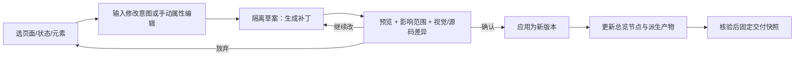

# AI Design Agent：从初版资料包到可交付设计 V02

> 2026-09-29｜设计测试题研究与方案推导。V02 针对上一版的缺口：补充 Lovart、Miora、Holopix、无限画布和 Pencil（现 pen.dev），明确「产物用什么载体承载」「设计师如何改」「如何交给开发」。公开产品能力以官方资料为准；下文的工作区、优先级和交互属于方案推论，尚未经过客户端实测或用户验证。V01 的更广泛 17 款产品扫描及 25 条链接保留在同包中。

## 0. 对题目的重新理解

题面有两个交付：Task 1 为 AutoClaw 的 Design Agent 设计工作区，重点是用户完成一次生成任务后如何查看、预览、编辑和管理 HTML 产物；Task 2 选择一个尚值得深入的新能力，讲透问题、机制、交互与价值。输入可以是自然语言、截图、Figma、PRD 和代码，当前主产物是 HTML。[题目截图]

真正的断点不是「再生成一个 Demo」，而是生成后出现的**资料包与可运行初稿如何成为一个可以持续修改、可追溯、可交付的设计项目**。AutoClaw 的公开介绍已经包含聊天修改、评论局部修改、画布微调、多设备预览和多格式导出，[A1] 因此不能把这些基础操作本身包装成新 Feature；应研究它们之间的产物关系和修改后的回写、版本、移交。

本稿只选择一个典型情境：产品设计师基于 PRD、旧版 Figma、品牌 token 和现有代码，让 Agent 生成「邀请团队成员」的桌面与移动端 HTML 初稿；她需要改邀请表单、错误态和移动端布局，给 PM 评审，然后交给前端开发。

## 1. 新增工具研究：从能力清单转向「产物如何继续工作」

| 工具 / 载体 | 官方可确认的设计相关能力 | 生成后的继续工作方式 | 对本题的可迁移机制与边界 |
|---|---|---|---|
| **Lovart**：无限画布 + 素材对象 | 无限画布可摆放/调整对象、进入 Quick Edit、查看图层历史；Generated Files 面板、画框和小地图帮助组织结果。可导出 PNG、SVG、PSD、PPTX、MP4，支持将图像分层编辑。[L1–L4] | 在空间中对比方向、组合素材、局部编辑、导出不同用途的资产 | 借鉴**空间化总览 + 可定位修改 + 资产集合**；它主要解决视觉资产工作，不等于可运行 HTML 页面和业务交互的主编辑器。 |
| **Miora**：AI 原生创意工作室 | 腾讯官方介绍强调持续记忆保持视觉一致性；一次 brief 调度多种技能，产出图形、视频、3D、UI 等生产素材包，并描述过程可编辑、可追踪。[M1–M2] | 围绕同一创作意图组织多媒体资产和上下文 | 借鉴**brief／品牌约束作为持续上下文**，而不是每次修改重新贴 PRD。官网材料没有足够细节证明具体画布交互或 HTML 回写能力，不能据此推断。 |
| **Holopix**：游戏美术流程 + 自由画布 | 官方工具入口列出图生图、局部替换、消除、放大和自由画布；教程展示参考图/线稿到风格变体、局部修图、元素拆分、独立 PNG、宣传物料的链路。[H1–H2] | 把整体视觉稿拆为可复用的独立元素，并形成资源包 | 借鉴**认可方案后拆资产**。它的主要场景是游戏美术；单独 PNG 资源不能替代通用产品 UI 的状态、交互和前端源文件。 |
| **Pencil → pen.dev**：无限设计画布 + 代码邻近 | 官方站点称支持 HTML/Figma 导入、从浏览器复制网页为可编辑图层、组件/变量/库、HTML 导出与开放 JSON 格式 `.pen`；文档描述 `.pen` 放在代码仓库、代码转设计、设计转代码、CSS 变量同步，并提醒改动后检查两边文件。[P1–P3] | 把运行页面带入可编辑图层，或从设计文件更新代码，再由人检查差异 | 最贴近本题的证据：**画布编辑与代码主产物必须建立明确映射和复核环节**。文档并未证明任意 HTML 可无损转成高质量设计系统或无冲突双向同步。 |
| **Figma Make / v0**：运行预览 + 点选修改 | Figma Make 支持运行原型、点选提示、属性及代码编辑，预览可转可编辑图层；v0 支持在运行预览里选元素、修改属性或输入局部指令，并形成新版本。[F1–F3] | 围绕当前预览直接改，再明确应用为版本 | 借鉴**所见位置 → 有范围的修改 → 差异确认**。能力已常见，创新点需落在跨产物的稳定回写与交接。 |

### 这些产品放在一张「产物地图」上

```text
输入证据（PRD / Figma / 截图 / 代码 / 品牌规范）
  → 生成资料包（方向、页面、HTML/CSS/JS、资源、预览图、说明）
  → 空间总览（各方向、页面、状态、资源的关系与比较）
  → 选定一个版本，在可运行页面中精准修改
  → 验证修改是否进入 HTML 主产物并影响哪些页面/状态
  → 固定交付快照（评审链接 / 设计延续文件 / 开发源码）
```

Lovart 证明「无限画布」适合容纳分支和素材；Holopix 证明某些视觉稿需要拆成可复用资产；Miora 强调贯穿创作的上下文；pen.dev 把可编辑设计与代码同步问题摆到台前。**四者共同指向的机会不是另一个生成按钮，而是让初稿中的每一次修改有明确对象、可回写的主产物、可检查的结果。**这是本报告从资料做出的推论，不是这些厂商共同宣称的结论。

## 2. 载体决策：设计师到底在哪里改？

题面明确当前产物为 HTML。因此本方案设定 **HTML 项目（HTML/CSS/JS、依赖和资产）是运行与开发交接的主产物**；截图、画布缩略图、PDF、Figma/`.pen` 等是从某个版本派生的视图或文件。实际产品若已有结构化设计文档模型，这一设定需要随客户端核实。

| 候选载体 | 适合的工作 | 单独承担全程的断点 | 本方案角色 |
|---|---|---|---|
| 对话 + 附件列表 | 追溯意图、下达指令、查看单次输出 | 页面、状态和版本难比较；选区与源文件关系弱 | 作为命令和决策记录，不作为工作区骨架 |
| **无限画布** | 方向发散、页面全貌、流程和参考并列、资产关系、方案比较 | 复杂交互难完整运行；任意拖拽可能只改了画布副本 | **空间总览**：每个节点对应一个可追溯的页面/状态/版本 |
| **聚焦预览编辑器** | 跑交互、切断点、选元素、微调文字/属性、看代码影响 | 不适合同时容纳大量方向、参考和素材 | **主修改场**：改动落在 HTML 项目分支里 |
| 外部 Figma/pen 文件 | 深入原生图层、与既有设计团队协作 | 转换可能丢组件、约束、逻辑；另一套文件易过期 | 按需派生并显示同步状态/转换损失 |

**推荐形态：同一 Design Workspace 的两种视图。**「总览画布」让设计师看全资料包、连起任务与结果；点一个页面/状态进入「聚焦工作台」，看到真正运行的 HTML 并修改。两者读同一个版本清单。画布节点只是该版本的可点击投影，不能悄悄成为第二份主稿。画布上对页面做直接编辑时，仍须生成对 HTML 的补丁、显示预览与差异、由设计师应用；若无法可靠映射，只允许批注或生成建议，不伪装成已经改了源文件。

### 资料包的最小数据结构（方案假设）

```text
Project / 项目
├─ Task / 任务：目标、输入来源、约束、未确认假设
├─ Design Set / 设计集
│  ├─ Direction / 方向 A、B
│  └─ Version / v1、v2…（唯一标识 + 创建原因）
│     ├─ Source / HTML、CSS、JS、资产、运行方法
│     ├─ Screens / 页面 × 状态 × 设备的可运行入口与缩略图
│     ├─ Canvas nodes / 指向 Source 中具体版本的空间节点
│     └─ Change records / 选区、指令、代码/视觉差异、接受人
└─ Handoff Snapshot / 固定版本、接收对象、清单与已知问题
```

设计师找产物的第一层是项目/任务，选方案的第二层是方向/版本，检查完整性的第三层是页面/状态/设备；图片与 PDF 仅显示其来源版本。这样「资料包」不是下载后散落的 ZIP，而是一个可打开、可回到、可移交的工作对象。

## 3. 初版设计稿修改到交付：一条可画成界面的路径

| 步骤 | 设计师动作与具体例子 | 工作区的反馈 / 必要状态 | 形成的产物 |
|---|---|---|---|
| **1 接收** | Agent 报告邀请流程已生成。设计师打开任务。 | 首屏列出输入来源、2 个方向、4 个页面、桌面/移动断点、缺失的错误态；提示哪些数据是模拟的。 | 可浏览的 v1 资料包 |
| **2 看全局** | 在无限画布把方向 A/B、旧 Figma、PRD 摘要和页面流程并列；标记方向 A 为候选。 | 每个节点显示版本、类型、更新时间和来源；方向之间可并排。 | 被选定的候选方向与决策理由 |
| **3 聚焦** | 打开「填写邮箱」页面，切到移动端，点开「无效邮箱」状态。 | 聚焦工作台运行真实 HTML，选中的元素与对应页面/状态绑定，保留返回总览的位置。 | 明确的修改目标 |
| **4 修改** | 小改：把标签文案改清楚、调整间距；结构改：选表单区域说「错误提示放到字段下方，成功态不动」。 | 小改可直接编辑；AI 改动先形成**隔离草案**，列出目标、预计影响文件/页面、修改后的实时预览。 | 待确认补丁 |
| **5 比较与应用** | 看移动端前后图、DOM/CSS/组件差异和受影响状态；若误伤桌面端则拒绝或缩小范围。 | 「应用为 v2 / 继续修改 / 放弃」；记录修改意图、来源选区、受影响文件、接受者。源代码与画布缩略图从同一版本刷新。 | 可回退的 v2 HTML 主产物 |
| **6 验证与评审** | 跑邀请入口→填写→错误→成功，检查桌面和移动；PM 在 v2 错误态留言。 | 状态矩阵显示已检查、未覆盖、已知问题；评论固定在页面/状态/版本，失效锚点要提醒。 | 评审结论与 v3 候选 |
| **7 冻结与移交** | 选定 v3，选择接收方为前端。 | 固定快照；有仓库接入则提供代码变更/PR 草案，未接入则给源码 ZIP；两者都附资源、运行说明、页面状态表、设计 token、交互说明、已知问题。 | 可追溯交付快照 |

路径中的「代码差异」和「受影响状态」是产品设计目标，不表示 AutoClaw 当前已经实现。交付到 PR 也以用户连接仓库并具备相应权限为前提；题目方案阶段仅描述体验，不对真实仓库执行发布。

### 三种接收人的交付，避免「可交付」含糊

| 接收人 | 主载体 | 必带内容 | 可继续做什么 / 边界 |
|---|---|---|---|
| PM / 评审方 | 固定版本的可交互预览链接 | 页面状态目录、评论、模拟数据和待确认问题 | 可体验和反馈；不能把静态截图当作完整交互规格 |
| 设计团队 | 工作区版本链接；按需导出 Figma/pen 可编辑文件 | HTML 源版本、token/资源、转换报告、未映射图层 | 可继续设计；派生设计文件与 HTML 的同步关系必须显式标注 |
| 开发 | 连接仓库的变更分支/PR 草案，或源码 ZIP | 源文件/资源/依赖、运行方法、页面×状态×断点表、交互和组件映射、检查与问题 | 可继续实现与重构；Demo 代码不默认等于生产级代码 |

「直接给开发」的验收标准不是一个 ZIP 是否生成成功，而是开发能复现指定版本、看到关键状态与交互、辨认哪些代码和资产由 AI 生成、知道未解决项与技术假设。若已有代码库，还应避免将一个孤立 HTML 页面误当成可直接合并的组件。

## 4. Task 2 只深入一个 Feature：可回写设计分支

V01 曾推荐「交付前设计核验」。进一步核查发现 AutoClaw 公开材料已包含视觉检查、页面问题识别，[A1–A2] 核验仍是交付门槛，但作为开放题主角与现有能力区分不足。V02 将 Feature 改为 **「可回写设计分支」**：把在画布/预览中提出的设计修改安全地写回 HTML 主产物，再把结果同步到所有派生视图和交付快照。

### 为什么选它

| 候选 | 对设计师的价值 | 与当前题目关系 | 判断 |
|---|---|---|---|
| 再做无限画布 | 强化探索与展示 | 仅有画布不能保证改动进入 HTML | 作为 Task 1 的载体，不是唯一新能力 |
| HTML 一键转 Figma | 熟悉的图层编辑 | 任意 HTML 的组件/布局/交互转换可能有损 | 后续能力，先透明报告转换质量 |
| 自动核验 | 降低遗漏 | AutoClaw 已公开提及类似视觉检查 | 纳入交付流程的检查步骤 |
| **可回写设计分支** | 让精修不再停留在截图或第二份画布；支持安全试改、比较、应用与回退 | 直接解决初稿到可交付源文件的断点 | **开放题唯一深入方向** |

**用户问题**：设计师圈出一处并说「只改移动端表单错误提示」。Agent 生成了新视觉，但设计师不确定它改了哪个文件、是否影响桌面端、手动在画布上改的东西是否进入交给研发的 HTML；为了保险只能重新整理文件和说明。

**核心机制**：一个改动不是即时覆盖主稿，而是「锚定选区和目标状态 → 在隔离分支形成 HTML/CSS/JS 补丁 → 同时展示运行预览、视觉差异与源码差异 → 人确认后成为新版本 → 相关画布节点、缩略图和交付包随版本更新」。这是一种产品交互语义，不规定底层必须使用 Git；接入仓库时可对应代码分支/提交。



### 核心交互屏（建议优先画）

1. **选区时**：高亮元素、所在页面/状态/设备、关联组件；右栏提供「直接改文字/样式」「请 Agent 改结构」，并明确“仅当前断点 / 全部断点”。
2. **草案时**：中央左右对比原版与草案；右栏展示修改意图、受影响页面/状态、文件清单和代码片段；顶部清楚写「尚未应用」。
3. **应用时**：提示「保存为 v2」，展示可回退节点；若该版已有团队评论或后续修改，提示冲突并让设计师选择保留/合并/重新生成。
4. **交付时**：只允许选一个已确认版本生成快照，附分支改动摘要与检查结果；后续改动生成新快照，不悄悄改变已分享版本。

**技术与体验边界**：HTML 可能是缺少组件结构的单文件，DOM 节点和源代码位置不一定稳定；生成阶段应尽量写入稳定元素标识和页面/状态 manifest。映射置信度低时，退化为页面级修改建议并显示“需人工核对”，不能标成精准选区回写。跨多页面的共享样式修改需显示波及面。外部设计文件与 HTML 冲突时，不应默默双向覆盖。开发交接仍需工程审查，Agent 不能代替业务逻辑、安全与生产质量判断。

**价值验证**：用 5–8 位产品设计师做任务测试，给定一个 AI 生成的邀请流程初稿，要求完成一次局部文案改、一次结构改、一次回退和一次研发交接；观察①从初稿到可评审版本的时间，②对“哪版会发给开发”的判断正确率，③修改意外波及数，④开发复现版本及识别未完成状态的成功率。样本数是研究计划，不是验证结果。与当前 AutoClaw 的具体能力差距需在实测后调整。

## 5. AI 能做什么，以及产物边界

| 环节 | AI 可承担 | 人仍要决定 / 系统须提示 |
|---|---|---|
| 整理资料包 | 分类输入、提取页面/状态、生成缩略图与索引 | 需求冲突、来源失效、权限缺失 |
| 生成与发散 | 多方向视觉和 HTML 原型、基础响应式 | 品牌、产品策略、可读性与内容准确性 |
| 局部修改 | 根据选区提出代码补丁、生成前后预览 | 修改范围、共享组件波及、是否接受 |
| 画布和文件转换 | 生成设计图层、拆分素材、派生 PNG/PDF | 图层语义、Auto Layout、变量和交互可能有损 |
| 核验 | 检查溢出、缺资源、链接、状态覆盖、token 偏差 | 真正的可用性、业务适配、极端情况和合规判断 |
| 开发交接 | 整理源码、资产、运行说明、状态表和差异 | 架构、维护性、性能、安全与上线验收 |

传统模式常以 Figma 画布作为设计主稿，再由研发实现；AI 生成可运行 HTML 后，主稿与演示原型合在一起，速度提高，但「是否也有一个原生设计文件」「哪个文件是准的」反而更容易混淆。建议工作区始终显示三种标签：**主产物**、**由版本派生**、**外部参考**。设计师可以按用途导出，不需先把所有文件强行转换为同一种格式。

## 6. 下一步设计执行顺序与交付清单

| 顺序 | 要验证的决定 | 本测试题下一阶段应产出的东西 |
|---|---|---|
| 1. 基线核实 | 实测 AutoClaw 当前画布、预览、文件组织、局部修改、版本能力，避免重复提案 | 现状截图与任务流程、能力差距表 |
| 2. 资料包样本 | 用一份真实或模拟 PRD/Figma/代码生成任务，清点得到哪些文件及版本关系 | 输入/输出 manifest、典型异常清单 |
| 3. Task 1 结构 | 以「总览画布 ↔ 聚焦工作台 ↔ 交付快照」画一条主路径 | 信息架构、关键页面线框、页面/状态/版本模型 |
| 4. Task 2 细化 | 验证可回写设计分支是否真能减少意外改动与交接歧义 | 选区、草案对比、应用/回退、交付四屏高保真与状态说明 |
| 5. 小规模可用性测试 | 设计师能否从初稿完成修改，开发能否复现交付版本 | 观察记录、失败点、迭代依据 |
| 6. 最终提交 | 让评审者在 5 分钟内看懂用户问题、取舍和完整链路 | 研究结论、体验地图、界面方案、交互原型、设计说明及文件包 |

当前 V02 是**研究和路线推导稿**，不是已经完成的界面设计或已验证的产品事实。下一阶段最应优先画的是「任务完成后的资料包总览」「HTML 聚焦编辑」「修改差异确认」「研发交付快照」四个关键状态，形成一条可以被真实设计师走通的路线。

## 7. 来源与证据范围

| 编号 | 官方资料 |
|---|---|
| A1 | [AutoClaw Auto Design 产品介绍](https://autoclaw.zhipuai.cn/blog/product/auto-design-ai-designer/) |
| A2 | [AutoClaw GLM-5.3-Flash 发布说明](https://autoclaw.zhipuai.cn/blog/model/glm-5.3-flash/) |
| L1 | [Lovart Customize your canvas](https://www.lovart.art/docs/edit-your-design/customize-your-canvas) |
| L2 | [Lovart How Lovart works](https://www.lovart.art/docs/getting-started/how-lovart-works) |
| L3 | [Lovart Basic AI editing](https://www.lovart.art/docs/edit-your-design/basic-ai-editing) |
| L4 | [Lovart 更新日志](https://www.lovart.ai/zh/changelog) |
| M1 | [腾讯：Miora AI-native creative studio](https://www.tencent.com/tencent-rolls-out-new-ai-tools-and-enterprise-solutions-for-global-markets-at-inaugural-tencent-cloud-day-hong-kong/) |
| M2 | [腾讯：HY 3 与 Miora 工作流](https://www.tencent.com/tencent-hy3-now-available-globally-extending-practical-ai-across-products-workflows-and-cloud-services/) |
| H1 | [Holopix 官方工具入口](https://private.holopix.cn/home) |
| H2 | [Holopix 官方教程：游戏 UI 设计流程](https://holopix.cn/aiAcademy/detail?articleId=73&tutorialType=4) |
| P1 | [Pencil（pen.dev）官网](https://www.pen.dev/) |
| P2 | [Pencil 文档：Design and code](https://docs.pen.dev/design-and-code/design-to-code) |
| P3 | [Pencil 文档：Interface](https://docs.pen.dev/core-concepts/pencil-interface) |
| F1 | [Figma：Introducing Figma Make](https://www.figma.com/blog/introducing-figma-make/) |
| F2 | [Figma：Bringing Figma Make to the Canvas](https://www.figma.com/blog/bringing-figma-make-to-the-canvas/) |
| F3 | [v0：Design Mode](https://v0.app/docs/design-mode) |

来源日期随网页更新；本文在 2026-09-29 检索。没有对 Lovart、Miora、Holopix、pen.dev 或 AutoClaw 进行账号内端到端实测，也没有确认各产品的定价、权限和稳定性。V01 的更广泛产品与来源作为背景资料保留，本版以问题推导和典型路径为准。
