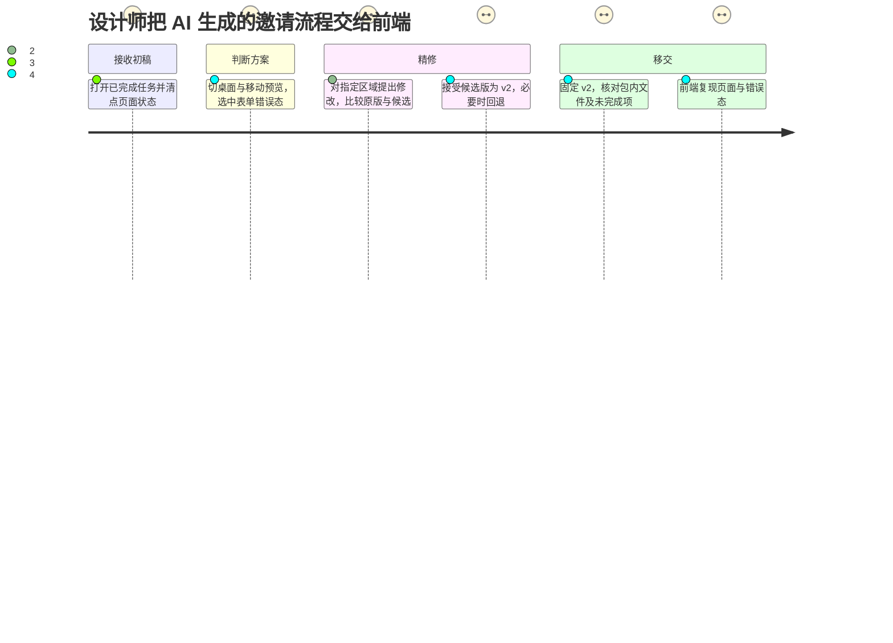
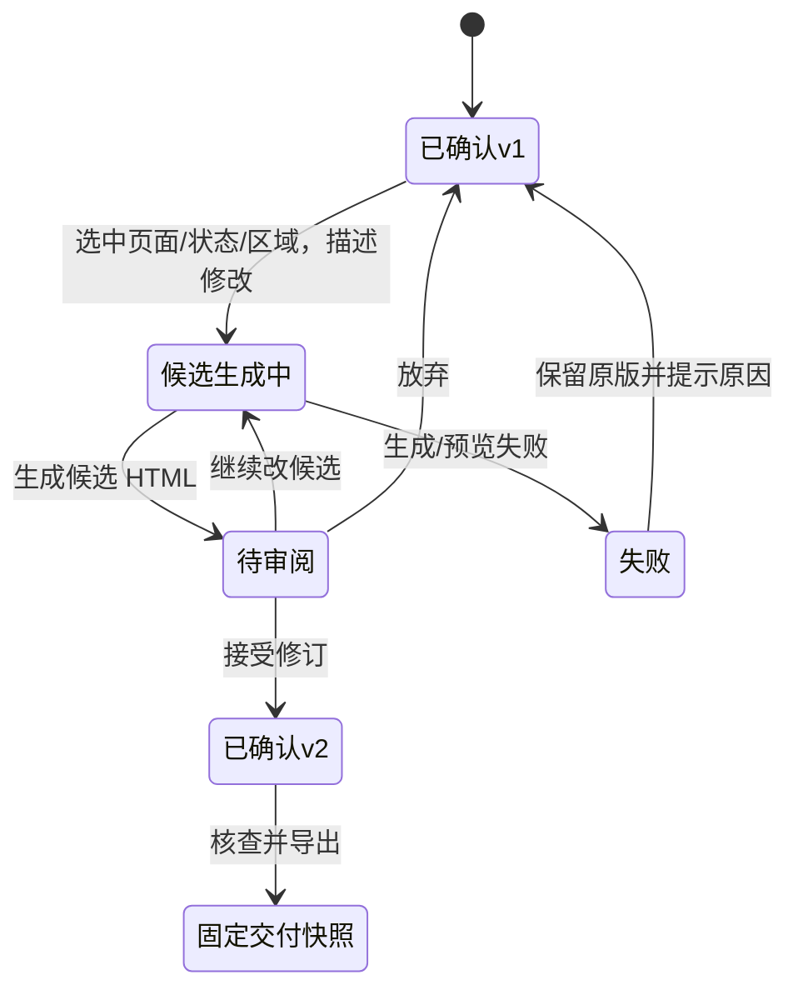
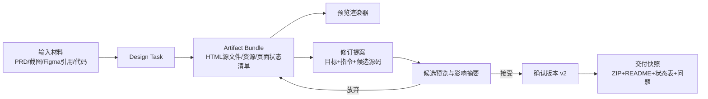

# AutoClaw Design Agent 工作区｜MVP 产品方案初稿 V03

> 日期：2026-10-04 · 角色视角：产品经理 · 阶段：问题定义与可评审的 MVP 范围。本文以用户提供的两段录屏、测试题、当日 AutoClaw 客户端只读走查及官方公开资料为依据。**录屏中的 AutoClaw 任务是图片生成，不是 Design Agent 的 HTML 生成流程**；因此涉及 Design Agent 现状的判断，只能引用官方描述，未在录屏或客户端里验证的能力一律标为待核实。

## 先给决策

**MVP 的产品对象是一次 Design 任务生成的 HTML 项目，而不是新建一个全局设计软件。**沿用 AutoClaw 已有的「项目 → 任务 → 对话 / 输出产物 / 工作区」外壳，在 HTML 任务完成后进入「设计工作区」：先确认生成了哪些页面与状态，再在可运行预览中做一次有范围的修改，比较前后并接受为新版本，最后固定该版本导出开发接手包。

**Task 2 唯一深入的 Feature：修订提案。**Auto Design 官方已经描述聊天改大方向、评论改局部、画布直接微调及多格式导出，[S1] 所以「再加选区编辑」「再加画布」没有足够新意。修订提案补的是操作之间的决策层：**修改谁、影响哪里、是否已经进入可交付 HTML、能否拒绝与回退**。本方案仍需验证当前客户端是否已有等价机制，不能把公开资料未提及等同于产品不存在。

本轮不做可运行原型，不声称设计已验证。文档的目标是让后续界面设计有清晰的场景、对象、核心状态和验收标准。

## 1. 证据与体验边界

| 证据 | 实际覆盖范围 | 能支持的结论 | 不能支持的结论 |
|---|---|---|---|
| [AutoClaw 录屏](</Users/jean/Desktop/面试准备/15 智谱华章/测试题/export-1791049123241.mp4>)，约 145 秒 | 首页、新建任务、图片生成、智能体创建、设置、连接器 | 当前通用任务外壳、任务结果呈现、连接器入口的实际样式 | 不能证明 HTML Design 任务如何组织页面、版本、预览或导出 |
| [Lovart 录屏](</Users/jean/Desktop/面试准备/15 智谱华章/测试题/调研/export-1791049321042.mp4>)，约 70 秒 | 已生成素材的画布、选中对象、Quick Edit、旁置新结果、更多工具 | 成熟视觉工具怎样把「生成后继续编辑」嵌入画布 | 不能证明同一机制能无损适用于 HTML、交互和代码 |
| 2026-10-04 AutoClaw 客户端只读走查 | 已完成图片任务的「输出产物」抽屉、可展开「浏览器 / 文件」工作区；未发起新任务或消耗积分 | 现有工作区容器和产物入口可作为设计落点；图片任务的抽屉为空 | 不能推断所有类型产物都为空，也不能判断 Design Agent 的专属画布是否已经有版本机制 |
| [Auto Design 官方介绍](https://autoclaw.zhipuai.cn/blog/product/auto-design-ai-designer/) | 声称的需求澄清、左对话右画布、三种修改、多端预览、多格式导出 | 方案应在现有能力基础上设计，不能重复发明这些功能 | 公开文章不等于当前客户端每个状态的实测证据 |

### AutoClaw 录屏逐步观察

| 步骤 / 录屏时间 | 看到的界面与行为 | 体验判断及设计含义 |
|---|---|---|
| A1，约 00:20：[任务首页](evidence/A01-任务首页与输入框.png) | 左栏同时有任务、智能体、项目、Skill & 连接器；中心是通用输入框、场景快捷入口，输入框下可选项目。 | **优势**：项目与任务是现成的归属结构。**机会**：用户做完设计任务应从任务返回结果，无须另找一个「Design 首页」。首页不用成为本题主屏。 |
| A2，约 00:30：[任务运行中](evidence/A02-任务运行中.png) | 输入成为独立任务，左栏显示任务名和运行标记，主区显示处理进度与对话。 | 「一次生成」已有任务身份；设计结果应该成为该任务下可反复访问的对象，而不是又开一个不相干项目。 |
| A3，约 01:20：[图片结果](evidence/A03-聊天内图片结果.png) | 结果嵌在聊天回答中，有放大、复制/分享、继续追问；这次是单张图片。 | 图片结果可以在聊天里消费；**多页面 HTML 设计集**若仅按消息排列，跨页面/状态/版本比较会变难。这是场景推论，需用 HTML 任务实测验证。 |
| A4，约 02:10：[连接器列表](evidence/A04-连接器列表.png) | 「Skill & 连接器」是独立页面，卡片列出可连接的服务，屏幕当前主要为法律/企业信息类。 | 设计输入可继续通过附件/链接进入任务；MVP 不依赖新增 Figma 连接器。截图上方的 Figma 图标不等于已提供可用的 Figma 卡片。 |
| A5，客户端只读走查 | 已完成图片任务右上有「输出产物」抽屉；抽屉提示文件会显示在此，但该图片任务为空。任务右侧可展开带「浏览器 / 文件」的工作区。 | 可复用这两个现有入口：输出产物作为「设计集入口」，右侧工作区作为 HTML 预览/文件承载。**不能**因为一项图片任务为空就宣称整个产品没有产物管理。 |

**可见的易用性风险**：首页和连接器页有较多灰色次要文字、图标按钮依赖符号识别；如果把更多设计功能继续堆进同一层，找入口和理解状态可能更费力。这里只能从画面提出风险，键盘、读屏、色彩对比度与可点击面积尚未实测。

### Lovart 录屏逐步观察：生成以后怎样继续做

| 步骤 / 录屏时间 | 看到的行为 | 可迁移的机制 |
|---|---|---|
| L1，约 00:00：[素材总览](evidence/L01-Lovart素材总览.png) | 蝴蝶结、多组肤色/袖口的手、不同姿态素材共存于画布；右侧保留 Agent 说明与历史结果。 | 不抹掉早期探索结果，用户能把方向和素材放在同一上下文里判断。 |
| L2，约 00:10：[选中对象](evidence/L02-Lovart选区快捷工具.png) | 点击一只手后出现边框和对象上下文工具，包含放大、去背景、橡皮、图层拆分、编辑文字等。 | **先明确修改对象**，再展示与对象类型相关的操作；不要让所有命令都从空白对话框开始。 |
| L3，约 00:15–00:20：[局部指令](evidence/L03-Lovart选区局部指令.png) | 被选对象下方直接出现 Quick Edit 输入框，用户输入「两只小手」。 | 修改意图与选区天然绑定，省去重新解释「改哪张图」。对 HTML 则需同时绑定页面、交互状态与断点。 |
| L4，约 00:25–00:45：[旁置候选结果](evidence/L04-Lovart原稿旁新结果.png) | 原素材保留，新候选在旁边生成；画布还有 Frame、占位的生成对象及可拖拽布局。 | 候选结果应先可比较，不直接覆盖认可过的初稿。对 HTML 需要的是**候选版本**，并非在画布上复制一张静态页面。 |
| L5，约 01:05：[对象工具与下载](evidence/L05-Lovart对象工具与下载.png) | 选中对象后显示更多处理、裁切、旋转等工具，右端有下载入口；官网还说明图层历史与 Generated Files 面板。[S2] | 形成交付必须让设计师知道「导出的是哪个对象、哪个状态、哪份文件」。但 Lovart 的主要交付对象是视觉素材，不能照搬为网页开发包。 |

Lovart 的本质不是「画布无限大」，而是**每份生成物可被选中、继续处理、保留候选、单独导出**。这种对象化链路可借鉴；对 AutoClaw 的 HTML 场景，主对象应是「可运行项目版本 × 页面 × 状态」，素材只是其中一类子对象。

## 2. 从观察到问题定义

题面明确：输入可能是自然语言、截图、Figma、PRD、代码；当前设计产物是 HTML。[题目截图] 因此设计师完成任务后真正要做的事不是管理聊天，而是回答五个连续问题：

1. **得到了什么？** 哪些页面、状态、资源和代码生成成功，哪些未完成？
2. **现在看的是哪份？** 方向、版本和设备断点能否辨认？
3. **我要改哪里？** 局部修改是否绑定具体页面/区域，而非再次描述整个项目？
4. **改完发生了什么？** 修改会影响其他状态/断点吗？能否先比较再接受？
5. **交付的是哪一版？** PM 能否评审，前端能否复现，素材与 HTML 是否来自同一个版本？

产品机会陈述：**让设计师在同一个任务中，把 AI 生成的 HTML 初稿收束成一份可定位修改、可确认版本、可复现交付的设计成果。** 这不是对 AutoClaw 当前缺失能力的断言；差距优先级需要用真实 HTML Design 任务走查验证。

### 典型用户与情境

主用户为产品设计师。她输入成员邀请流程的 PRD、旧设计截图、品牌 token 和已有代码，Agent 生成一个含「入口—填写邮箱—错误—成功」的网页初稿。她要调整移动端错误提示的位置，核查桌面端没有被误改，然后交给 PM 与前端。

这一情境同时覆盖生成后**查看、预览、编辑、版本、交付**，没有引入复杂多人权限或大型设计系统迁移；适合作为测试题的完整主线。

## 3. 用户旅程与体验断点



上图的情绪分数是**待验证的设计假设**，不是访谈数据。最需要设计的低点是「精修」：已有 AI 工具可以产生新结果，但如果修改的对象、范围和是否应用不明确，设计师不敢把它作为开发基线。

| 旅程阶段 | 用户此刻的判定 | MVP 必须提供的证据 |
|---|---|---|
| 进入结果 | 「任务算完成了吗？」 | 任务完成状态、HTML 主文件、页面/状态清单、缺失项 |
| 浏览与预览 | 「这版覆盖需求吗？」 | 可运行预览，页面、状态、桌面/移动切换；当前版本标识 |
| 选区修改 | 「Agent 知道我改哪儿吗？」 | 目标页面/状态/断点/区域固定在修订提案卡上 |
| 审阅修改 | 「它还改了哪里？」 | 原版/候选版并排、变动摘要、受影响文件/状态、拒绝入口 |
| 交付接手 | 「交给前端的和我看的是同一版吗？」 | 固定版本号、可运行 HTML、资产、运行说明、状态表和已知问题 |

## 4. 核心取舍：什么进 MVP，什么不进

### 载体方案比较

| 方案 | 好处 | 对本题的代价 | 判断 |
|---|---|---|---|
| 单独新增全局「Design」首页 | 容易作为专题推广 | 重建项目/任务导航，分裂当前对话与产物；测试题重点在任务结束后 | **不选** |
| 完整 Lovart 式无限画布 | 适合大量素材、方向发散与自由编排 | HTML 页面与交互状态不能仅用平面对象表达；实现和版本同步复杂 | **MVP 不选**；未来用于多方向探索 |
| Figma 文件为主稿 | 设计师熟悉图层编辑 | 题面当前产物是 HTML，转换可能丢组件语义、约束与交互 | **不选为主载体**；后续按需导出 |
| **任务内的成果总览 + HTML 聚焦工作台** | 沿用现有入口；可看完整结果、改可运行项目、固定版本 | 需要清楚定义成果对象与版本规则 | **MVP 选择** |

### 功能优先级（按端到端链路，不按功能数量）

| 等级 | 能力 | 进入或延后的理由 |
|---|---|---|
| P0 | 完成任务后从「输出产物」进入设计成果；显示页面/状态/资源与当前版本 | 找到结果是后续所有动作的前提；复用已有入口 |
| P0 | 可运行 HTML 预览，页面/状态/桌面与移动切换 | 设计师必须看到真实交互，截图不足以评审 |
| P0 | **修订提案**：绑定目标、生成候选、前后比较、接受/拒绝、形成新版本 | 让一次局部精修可控且可追溯，是 Task 2 的深入点 |
| P0 | 固定版本并导出 ZIP + 简短交付清单 | 保证前端拿到的与评审通过的是同一版 |
| P1 | 评论/多人评审、完整状态覆盖自动检查、版本叠加差异 | 有价值，但不是本轮闭环的必要条件；复用现有评论能力待核实 |
| P1 | 自由无限画布、跨方向素材整理、全局历史搜索 | Lovart 的启发，但单一 HTML 主路径先不依赖它 |
| 暂不做 | 任意 HTML 无损转 Figma、Figma↔HTML 实时双向同步、Git PR 自动合并、生产级代码认证 | 转换与工程质量边界过大；pen.dev 文档也要求双向修改后检查两边文件。[S3] |

## 5. Task 1｜Design 工作区 MVP

### 入口与信息架构

**进入条件**：一次任务产出可运行 HTML 项目。任务的「输出产物」抽屉显示「设计成果 v1」卡片，包含页面数、状态数、生成时间、可预览/需修复状态；点击后在该任务内打开 Design 工作区。普通文档或图片任务仍保持现有通用结果体验。

**导航**：全局左栏「项目 / 任务」不变；任务内增加「对话 / 设计工作区」切换。工作区第一层是成果总览，第二层是某一页面的聚焦预览，返回时保留位置。现有可展开的浏览器/文件面板可承载预览与文件来源，但具体布局须与当前 Auto Design 专属画布实测对齐，避免平行复制两个预览。

```text
全局左栏（沿用）       当前设计任务
项目 / 任务       ┌─ 对话  |  设计工作区 ────────────────────────┐
                  │ 成果总览：方向 A · 当前 v1 · 4 个页面/状态    │
                  │ [入口] [填写] [错误] [成功]  + 资源/文件清单 │
                  │                                           │
                  │ 聚焦后：页面/状态/断点导航                  │
                  │ ┌──────── 可运行 HTML 预览 ────────┐       │
                  │ │ 选中表单错误提示；可继续交互     │ 修订 │
                  │ └──────────────────────────────────┘ 面板  │
                  │ 顶部：v1 | 未确认修订 0 | 准备交付          │
                  └───────────────────────────────────────────┘
```

### 四个必须画出来的界面状态

1. **任务完成 / 成果总览**：页面、状态、设备、资源、源文件；生成失败的部分明确显示；每个卡片可打开预览，不把“生成完成”误写成“可交付”。
2. **聚焦预览 / 选中区域**：真实 HTML 运行；当前页面、状态、设备、版本固定可见；设计师选中区域后，右侧显示可用操作与引用的输入依据。
3. **修订提案 / 前后比较**：原版与候选版并排，顶部写「候选 · 尚未应用」；变化列表说明受影响页面、断点和文件；可继续修改、拒绝或接受为 v2。
4. **交付快照**：指定 v2，显示包内源文件、资源、运行说明、页面/状态表、已知问题；生成一个不会随任务下一轮修改而变化的交付记录。

### 关键交互规则

- 当前版本在所有视图同名同号。缩略图、预览和 ZIP 必须指向同一 `version_id`。
- 页面状态是预览入口，不强制要求每个状态独立 HTML 文件。若状态需通过操作触发，工作区提供重放入口。
- 任何“接受修订”之前不覆盖已确认版本；拒绝候选不影响主稿。
- 新修订以最新版为基线；旧版上发起修改时先提示切换或另存候选，避免无意识覆盖。
- 预览无法启动、资源缺失或生成不全时允许查看已成功页面，但交付入口显示缺项。
- 如 Design Agent 现有画布已提供其中操作，应整合命名和状态，不再复制功能按钮。

## 6. Task 2｜唯一新增 Feature：修订提案

### 用户问题 → 核心机制 → 核心交互 → 值得做的理由

**问题**：设计师在预览里看到移动端错误提示位置不对，输入「放到邮箱字段下方」。现有工具可以让 AI 修改，但她需要先知道改动是否仅限这一状态、是否碰了桌面端、以及给前端的 HTML 是否随之更新。

**机制**：修订不是直接覆盖，而是生成一张**候选提案卡**，含目标、意图、候选预览、文件变更摘要、受影响范围和接受状态。设计师确认后，候选项目成为新版本；不同视图和导出物从该版本派生。MVP 可以使用项目快照，不要求底层一定用 Git 分支。



**核心交互路径**：

1. 设计师在 `v1 / 邀请表单 / 无效邮箱 / Mobile` 选中错误提示，点击「提出修改」。修订卡预填目标；可选择「仅此状态」或「同组件全部状态」。默认仅此状态。
2. Agent 在隔离候选中改 HTML/CSS/JS，原版继续可看。候选成功后，工作区展示双预览与「改动：错误文案 DOM、局部间距样式；预计影响：Mobile 错误态」等摘要。
3. 设计师切换 Desktop 和成功态做基本回归。发现误改可拒绝或继续限定；确认后点「接受为 v2」。任务和成果总览显示 v2，v1 可回看。
4. 交付快照只选择**已确认**版本；候选状态不能被误导出为正式交付。

**为何值得做**：Auto Design 公开资料中的聊天、评论和微调解决了“发出修改”；Lovart 录屏展示了对象锚定和候选并存。修订提案把二者对准网页设计的真正交接问题：**可运行的正式版本到底是哪份**。它将设计师的决定记录为产品状态，而非藏在聊天上下文中。[S1][S2]

**MVP 的技术边界**：只处理 AutoClaw 自己生成、源文件仍在任务工作目录的 HTML 项目。若 DOM 与源码不能稳定映射，允许退化到「页面级修改」，明确提示范围更大；不承诺任意截图、Figma 文件或外部站点可精准回写。若修改触及全局样式，受影响范围显示「可能影响所有页面」，不能伪装为局部安全。若 Agent 无法形成可运行候选，保留 v1 并给出错误，不产生半成品版本。

## 7. 简化系统对象与交付契约



| 对象 | MVP 必备字段 | 目的 |
|---|---|---|
| `ArtifactBundle` | task_id、source_path、asset_list、page_state_manifest、current_version_id、生成异常 | 一次任务产出的可运行主体与资料索引 |
| `Version` | version_id、base_version_id、创建时间、接受人/动作、source snapshot、预览状态 | 保证已确认版本可回看、可复现 |
| `RevisionProposal` | target(page/state/viewport/region)、instruction、draft_source、change_summary、impact_scope、status | 让 AI 修改先可审再生效 |
| `DeliverySnapshot` | version_id、文件清单、运行方法、状态表、已知问题、导出时间 | 保证接收方知道拿到的是哪份成果 |

前端交付包的最小结构（结构为方案建议，不代表当前产品已实现）：

```text
invite-flow_v2.zip
├─ src/                  # 可运行 HTML/CSS/JS
├─ assets/               # 页面引用的字体/图片/图标
├─ README.md             # 启动方法、依赖、设计目标、模拟数据说明
├─ pages-states.md       # 页面 × 状态 × Desktop/Mobile 与触发路径
├─ changes.md            # v1→v2 的接受修订与未解决问题
└─ manifest.json         # task_id、version_id、文件清单与生成时间
```

不承诺 ZIP 就是可直接合并的生产代码。研发需要审查组件拆分、真实数据、权限、安全、性能和可访问性；MVP 的“可交付”含义是**可复现、信息完整、版本明确**。

## 8. 验收标准、验证计划与待核实项

| 验收情境 | 可观察的通过条件 |
|---|---|
| 任务生成成功 | 首次进入的设计师在 30 秒内找到全部已生成页面、当前确认版本与未生成状态；时间门槛为测试目标，不是现有数据 |
| 预览初稿 | 可以在同一版本中切 Desktop/Mobile 并进入错误态；页面无资源缺失时可完成关键点击路径 |
| 局部修订 | 设计师能指出修订目标、看到候选与原版的区别、拒绝一次错误修改、接受一次正确修改；v1 保持可回看 |
| 交付开发 | 导出 ZIP 的 `version_id` 与预览所示一致；开发者按 README 启动，并能找到错误态、资源和已知问题 |
| 失败回退 | 候选生成或预览失败时，当前确认版及其交付快照不变 |

建议先用 5–8 位产品设计师完成上述任务、再让 2–3 位前端开发独立接收 ZIP。记录从初稿到首次可交付的时间、范围判断错误次数、候选被拒绝的原因、开发复现成功率与返工原因。样本和指标为**计划**，不是已经完成的验证。

上线前必须核实四个事实：① Auto Design 当前 HTML 项目是否保存完整源文件与可重启预览；② 现有评论/画布修改是否已经有版本和回退；③ 「输出产物」与浏览器/文件工作区是否能挂同一 `version_id`；④ Figma 输入在当前客户端是文件、链接还是连接器。若已存在等价机制，应优先改其可见性与连贯性，而不是重复开发。

## 9. 后续设计工作的最短路线

1. 用真实 Auto Design 任务做一次端到端走查，截图记录任务完成、产物抽屉、画布、修改、导出，并修正本稿现状假设。
2. 按本稿四个状态绘制工作区线框，优先打磨「选目标 → 候选比较 → 接受 v2 → 导出 v2」而非给每个功能画页面。
3. 用一份含 Desktop/Mobile 与错误态的 HTML 样本，做可点击原型；把未覆盖状态和失败提示一起设计。
4. 进行设计师任务测试与开发者交接测试，再决定无限画布、Figma 同步或仓库 PR 是否进入下一阶段。

## 来源

- [S1] [AutoClaw：Auto Design 官方介绍](https://autoclaw.zhipuai.cn/blog/product/auto-design-ai-designer/)，2026-08-14 发布，2026-10-04 核对。
- [S2] [Lovart：Customize Your Canvas](https://www.lovart.art/docs/edit-your-design/customize-your-canvas)，2026-10-04 核对；录屏中的行为以用户文件为准。
- [S3] [pen.dev：Design ↔ Code](https://docs.pen.dev/design-and-code/design-to-code)，2026-10-04 核对。
- [题目截图](</Users/jean/Desktop/面试准备/15 智谱华章/设计的作业.jpeg>)，作为需求题面而非产品现状证据。

完整逐步证据图存于本文同目录的 [`evidence/`](evidence/)；两段录屏原件保留在用户提供的面试资料目录，没有移动或修改。本文中的「MVP 方案」「机会」「指标」均为产品判断；录像、客户端只读观察和官方公开描述已分别标注。
